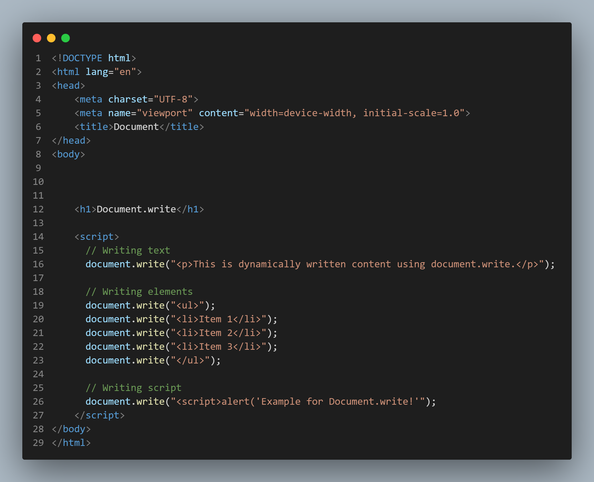
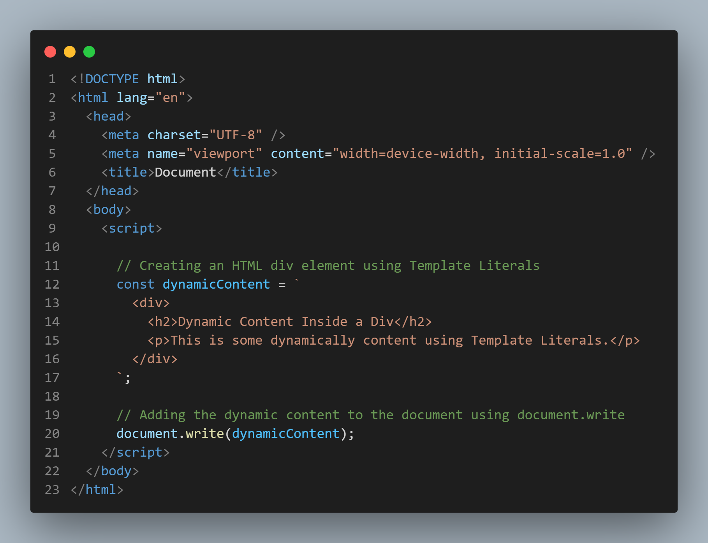

## How javascript work?
1.  there is engines that make js work (المحركات تعتبر قلب لأي لغة وهى تعتبر البرنامج الرئيسي الى بيقوم بقرائة كود الجافا سكريبت وينفذه)
2.  Lexical analysis (مرحلة التحليل) :
    *  scanning and this is made by parser (interpreterيعتبر الوحدة المبسطة من ال) -> parser breaks the code into tokens or chunks (this stage is called tokenization)
    *  parser remove comments and spaces because it does not need it
    *  parser made error handling to send the code clear
    *  after made previous 3 stages parser send the clear code as token stream
3. AST (Abstract Syntax Tree) which is a hierarchical representation of the code's structure which helps the engine understand the relationships between different parts of the code.
4. AST Traversal (in this stage the language start to understand the tree)
4. execution to execute the code
4. show results to the user
---
## what is document.write and it's job?
it is a method in JavaScript that allows you to dynamically write content directly to a web page , It's a simple way to generate content, such as text, HTML elements, or even script tags, and have it appear in the rendered HTML.

## By using Template Literals  give one example that have alt least one 
 and content inside it then assign it  inside document.write()

